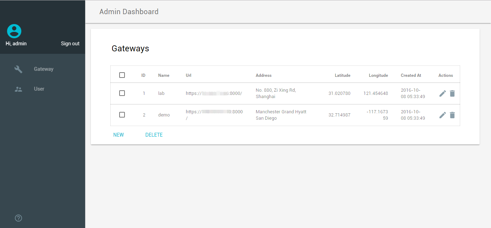

Smart Home Web Portal in a Docker container
===========================================

Here are the steps to run the Smart Home Web Portal in a Docker container.

## Prerequisites
* Install Docker on your system (please refer to the instructions located [here](https://docs.docker.com/engine/installation/) for this)

## Steps to run the container
1. Checkout source code
    * checkout the source to build the image and enter the docker folder (smarthome-web-portal/tools/docker)

2. Configurations
    * Update the preferred source in source.list    
      eg. change archive.ubuntu.com to hk.archive.ubuntu.com

3. Getting the Docker image     
   There are two options (described in step 3.1 and 3.2 respectively) to get the Docker image. We recommend using option 3.1 as it is simpler and quicker.
   
  3.1 Pre-built Docker image
     * Download the pre-built image hosted on DockerHub (https://hub.docker.com/r/smarthome2cloud/smarthome-demo/) by running the command below.
   `docker pull smarthome2cloud/smarthome-demo`
  
  3.2 Build the image
     * Under the Docker folder, run the command below to build the image. *smarthome2cloud* is the image name and *v1* is the tag of the image.    
        * `docker build -t smarthome2cloud/portal:v1 .`    
        * If the container is running behind a proxy, set up the http and https proxies through build args as below:    
        `docker build --build-arg http_proxy=http://<ip-of-your-proxy>:<port-of-the-proxy> --build-arg  https_proxy=https://<ip-of-your-proxy>:<port-of-the-proxy>  -t smarthome2cloud/portal:v1 .`    
        **Notice**: if you are using a corporate proxy, the proxy host name may not be parsed by the container's local DNS. Better to use IP address instead of hostname.     
        * When completed, you will see the following message:     
            ```    
            Removing intermediate container 82b756f0b245    
            Successfully built 5efd905d09df    
            ```       
    * This command will show the image status   
        `docker image`

5. Run the portal in a container    
    `docker run -d --name portal -p 3030:3000 -p 3031:4000 smarthome2cloud/portal:v1 `    
    **portal** is the name of the container;    
    **3030** is the forward port listening on the host. All the requests will be forwarded to the portal on 3000 in the container;    
    **3031** is the forward port listening on the host, which forwards the requests to admin portal running on 4000 in the container;        
    **smarthome2cloud/portal:v1** is the combination of the name and tag of the image;    

6. Point the portal to the gateway server
   * Open the admin portal thru `http://<host-ip-addr>:3031`
   * Enter the default login credentials: admin/admin
   * Click the Gateway tab on the left hand and update the gateway IP and geo location for gateway *"demo"*
          
   * Restart the container (Refer to step 8 on how to get the container id)    
      `docker restart <container id>`
   * Login to the Home portal thru `http://<host-ip-addr>:3030` (login credentials: ostro/ostro)

7. Troubleshooting the container
    * `docker ps -a`     
    Checks all the running containers and get the id and status of the containers. The output looks like this: 
    ```
    CONTAINER ID        IMAGE                       COMMAND                  CREATED             STATUS              PORTS      NAMES
    20be297949be        smarthome2cloud/portal:v0   "/usr/bin/supervisord"   49 minutes ago      Up 47 minutes       0.0.0.0:3030->3000/tcp, 0.0.0.0:3031->4000/tcp   portal0
    ```
    * `docker logs -f <container id>`    
   you can get the <container id> from `docker ps -a`. The command gets the latest 10 lines of the log output and continuously waits for new output. 
    * `docker start/stop/restart <container id>`    
    Update the container status
   
